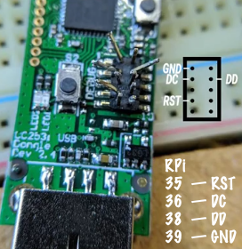

# Burn Raspberry Pi OS Lite image + attach empty 'ssh' file to the root of the SD card.

1.  `brew cask install applepi-baker` for both in one go or burn with else and  `touch ssh` .

2. With eth cable plugged straight to laptop, try `ping raspberrypi.local` to see ip address.

3. `ssh pi@192.168.1.241` or `ssh pi@raspberrypi.local` change pswd 'raspberry' right after.

4. `sudo raspi-config` to expand filesystem and lower video memory - no display.

5. `sudo apt-get update && sudo apt-get upgrade`

   

- great vscode plugin to mount a remote folder over SSH as a local Workspace https://github.com/SchoofsKelvin/vscode-sshfs

```
# run scripts after ssh disconencts
sudo apt-get install tmux
tmux

# 'ctrl-b' followed by 'd' to detach session

tmux ls
tmux attach -t 0
```

 


## CC2531 flash without CC debugger

https://github.com/jmichault/flash_cc2531.git

https://invidious.snopyta.org/watch?nojs=1&v=RguRQUXWLCY&feature=youtu.be

 

```
# if you got Raspberry Pi OS Lite as you should
sudo apt-get install wiringpi
gpio -v

sudo apt-get install git
git clone https://github.com/jmichault/flash_cc2531.git
cd flash_cc2531

# should be ID = b524, otherwise check wires
./cc_chipid

# backup
./cc_read backup.hex

# erase, write
./cc_erase
wget https://github.com/Koenkk/Z-Stack-firmware/raw/master/coordinator/Z-Stack_3.0.x/bin/CC2531_20190425.zip
./cc_write CC2531ZNP-Prod.hex
```


## Pi-hole - https://pi-hole.net/

`curl -sSL https://install.pi-hole.net | bash`
For network-wide ad blocking disable DHCP server on home router and then use Pihole as dhcp server ->
https://discourse.pi-hole.net/t/how-do-i-use-pi-holes-built-in-dhcp-server-and-why-would-i-want-to/3026


## Domoticz - https://www.domoticz.com/

```
curl -L https://install.domoticz.com | bash

wget http://repo.mosquitto.org/debian/mosquitto-repo.gpg.key
sudo apt-key add mosquitto-repo.gpg.key
sudo apt-get update
sudo apt-get install mosquitto
```

Do steps from https://www.zigbee2mqtt.io/getting_started/running_zigbee2mqtt.html#2-installing

```
sudo journalctl -u zigbee2mqtt.service -f
sudo systemctl restart zigbee2mqtt
```

```
sudo apt-get install python3-dev
cd ~/domoticz/plugins
git clone https://github.com/stas-demydiuk/domoticz-zigbee2mqtt-plugin.git zigbee2mqtt

# restart
sudo /etc/init.d/domoticz.sh restart
# ==
sudo systemctl restart domoticz.service
```

Go to “Hardware” page and add new item with type “Zigbee2MQTT” Set your MQTT server address and port to plugin settings.

Once plugin receive any message from zigbee2mqtt server it will try to create appropriate device. 


```
# https://www.domoticz.com/wiki/Homekit_Siri
sudo npm install -g --unsafe-perm homebridge@latest homebridge-config-ui-x@latest
sudo hb-service install --user homebridge

192.168.1.241:8581

# install plugin homebridge-edomoticz
# user:pass@192.168.1.241
# 8080
```

```
# factory reset hue bulb pairing if already paired to unavailable hub
# https://www.zigbee2mqtt.io/getting_started/pairing_devices.html
sudo apt-get install mosquitto-clients
sudo mosquitto_pub -d -t zigbee2mqtt/bridge/config/touchlink/factory_reset -m ""

# change power on behavior of hue bulb
sudo mosquitto_pub -h 127.0.0.1 -t zigbee2mqtt/0x0017880103fa64d6/set -m "{\"hue_power_on_behavior\": \"off\"}"
```


###### wait for network time, useful for power outage - pi boots faster than modem

```
sudo apt install ntp

# then edit start part accordingly
sudo nano /etc/init.d/domoticz.sh
```

```
#
# Function that starts the daemon/service
#
do_start()
{
        #wait for network time to complete
        ntp-wait
        if [[ $? -ne 0 ]];then
            echo ntp-wait did return with an error condition
            exit 1
        fi
```

https://github.com/stas-demydiuk/domoticz-zigbee2mqtt-plugin/issues/422 unsupported device issue


## mopidy - https://mopidy.com/

```
wget -q -O - https://apt.mopidy.com/mopidy.gpg | sudo apt-key add -
sudo wget -q -O /etc/apt/sources.list.d/mopidy.list https://apt.mopidy.com/buster.list
sudo apt update && sudo apt install mopidy

# to see available extenstions in repo
apt-cache search mopidy

# pip extensions
sudo apt install python3-pip -y
# frontend https://mopidy.com/ext/muse/
sudo python3 -m pip install Mopidy-Muse

sudo systemctl enable mopidy
sudo apt-get install mopidy-tunein mopidy-somafm mopidy-local mopidy-internetarchive

sudo nano /etc/mopidy/mopidy.conf
```

```
[core]
# persistent state
restore_state = true 

[audio]
mixer_volume = 30

[http]
hostname = 192.168.1.241

[file]
enabled = false

[local]
media_dir = /home/pi/music

[youtube]
enabled = true

# too many results in TuneIn? Add this so you only get stations
[tunein]
filter = station
```

```
mkdir music
sudo mopidyctl local scan
```

```
sudo systemctl start mopidy
sudo systemctl stop mopidy
sudo systemctl restart mopidy
```


##### shairport - https://github.com/mikebrady/shairport-sync/blob/master/INSTALL.md

```
sudo apt-get update && sudo apt-get upgrade

sudo apt-get install build-essential git xmltoman autoconf automake libtool libpopt-dev libconfig-dev libasound2-dev avahi-daemon libavahi-client-dev libssl-dev libsoxr-dev

git clone https://github.com/mikebrady/shairport-sync.git
cd shairport-sync
autoreconf -fi
./configure --sysconfdir=/etc --with-alsa --with-soxr --with-avahi --with-ssl=openssl --with-systemd
make
sudo make install

vi /etc/shairport-sync.conf
```

```
// Sample Configuration File for Shairport Sync on a Raspberry Pi using the built-in audio DAC
general =
{
  volume_range_db = 60;
  name = "Kitchen"; 
};

alsa =
{
  output_device = "hw:0";
  mixer_control_name = "PCM";
};
```

```
sudo systemctl enable shairport-sync
sudo systemctl start shairport-sync
```

